# uart 原理

[[toc]]

## uart 简介

UART 全称Universal Asynchronous Receiver/Transmitter，通用异步收/发器，是一种非常常见的异步收发协议，在嵌入式领域应用十分广泛。收发双方按照约定好通讯波特率进行配置，如果波特率不匹配会导致接收到乱码。


电脑主板上的接口展示:

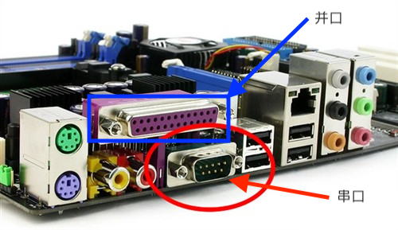


#### 接口连接线


### 并串

并行接口，称为并口。并行端口使用25针D型连接头。所谓“并行”是指通过并行线路同时传输8位数据，从而大大提高了数据传输速度，但是并行传输线路的长度受到限制，因为长度增加，干扰会增加，并且数据容易出错。目前，并行接口主要用作打印机端口等。

1. 以并行方式传输的数据通道的宽度，也称接口传输的位数；
2. 用于协调并行数据传输的额外接口控制线或称交互信号的特性。 数据的宽度可以从1～128位或者更宽，最常用的是8位，可通过接口一次传送8个数据位。在计算机领域最常用的并行接口是通常所说的LPT接口。

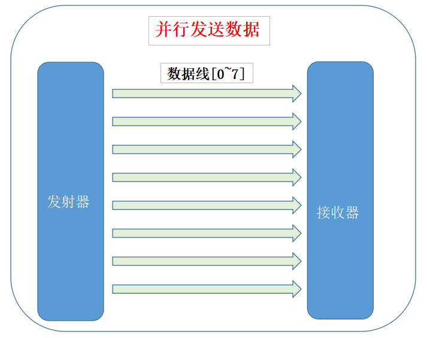


::: info 优缺点:
优点：因为可以多位数据一起传输，所以传输速度很快。

缺点：内存有多少位，就要用多少数据线，所以需要大量的数据线，成本很高.
:::

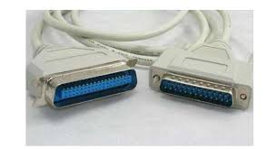


### 串口

串行通讯是指仅用一根接收线和一根发送线就能将数据以位进行传输的一种通讯方式。 尽管串行通讯的比按字节传输的并行通信慢，但是串口可以在仅仅使用两根线的情况下就能实现数据的传输。 典型的串口通信使用3根线完成，分别是地线、发送、接收。


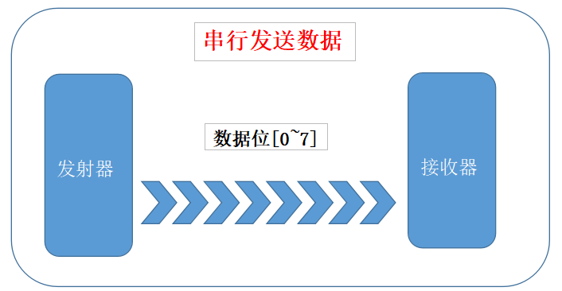

::: info 优缺点:
优点：使用的数据线少，在远距离通信中可以节约通信成本。

缺点：因为每次只能传输一位数据，所以传输速度比较低。
:::


### 单工通信

单工模式(Simplex Communication)的数据传输是单向的。通信双方中，一方固定为发送端，一方则固定为接收端。信息只能沿一个方向传输，使用一根传输线。


### 半双工通信

半双工模式(Half Duplex)通信使用同一根传输线，既可以发送数据又可以接收数据，但不能同时进行发送和接收。数据传输允许数据在两个方向上传输，但是，在任何时刻只能由其中的一方发送数据，另一方接收数据。因此半双工模式既可以使用一条数据线，也可以使用两条数据线。半双工通信中每端需有一个收发切换电子开关，通过切换来决定数据向哪个方向传输。因为有切换，所以会产生时间延迟，信息传输效率低些。


### 全双工通信

全双工模式(Full Duplex)通信允许数据同时在两个方向上传输。因此，全双工通信是两个单工通信方式的结合，它要求发送设备和接收设备都有独立的接收和发送能力。在全双工模式中，每一端都有发送器和接收器，有两条传输线，信息传输效率高。


## uart 通讯协议

典型的串口通信使用3根线完成，分别是：发送线（TX）、接收线（RX）和地线（GND），通信时必须将双方的TX和RX交叉连接并且GND相连才可正常通信，如下图所示：


### 硬件流控制

硬件流控制常用的有RTS/CTS流控制和DTR/DSR（数据终端就绪/数据设置就绪）流控制。

硬件流控制必须将相应的电缆线连上，用RTS/CTS（请求发送/清除发送）流控制时，应将通讯两端的RTS、CTS线对应相连，数据终端设备（如计算机）使用RTS来起始调制解调器或其它数据通讯设备的数据流，而数据通讯设备（如调制解调器）则用CTS来起动和暂停来自计算机的数据流。这种硬件握手方式的过程为：我们在编程时根据接收端缓冲区大小设置一个高位标志（可为缓冲区大小的75％）和一个低位标志（可为缓冲区大小的25％），当缓冲区内数据量达到高位时，我们在接收端将CTS线置低电*（送逻辑0），当发送端的程序检测到CTS为低后，就停止发送数据，直到接收端缓冲区的数据量低于低位而将CTS置高电*。RTS则用来标明接收设备有没有准备好接收数据。

常用的流控制还有还有DTR/DSR（数据终端就绪/数据设置就绪）。我们在此不再详述。由于流控制的多样性，我个人认为，当软件里用了流控制时，应做详细的说明，如何接线，如何应用。

`RTS`:（Require ToSend，发送请求）为输出信号，用于指示本设备准备好可接收数据，低电*有效，低电*说明本设备可以接收数据。

`CTS`:（Clear ToSend，发送允许）为输入信号，用于判断是否可以向对方发送数据，低电*有效，低电*说明本设备可以向对方发送数据。


### UART协议帧

在 UART中，传输模式为数据包形式。数据包由起始位、数据帧、奇偶校验位和停止位组成。

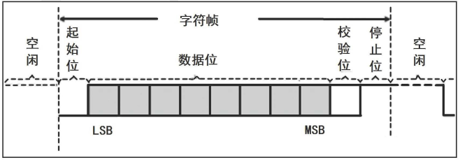


起始位 | 数据位 | 奇偶校验位 | 停止位
-----|------|------|------
1位 | 5~8位 | 0~1位 | 1、1.5、2 位
逻辑‘0’ | 0,1代码 | 0或1 | 逻辑‘1’

#### 起始位
当不传输数据时， UART 数据传输线通常保持高电压电平。若要开始数据传输，发送UART 会将传输线从高电平拉到低电平并保持1 个时钟周期。当接收 UART 检测到高到低电压跃迁时，便开始以波特率对应的频率读取数据帧中的位。

起始位必须是持续一个比特时间的逻辑0电平，标志传输一个字符的开始，接收方可用起始位使自己的接收时钟与发送方的数据同步。

#### 数据位
数据帧包含所传输的实际数据。如果使用奇偶校验位，数据帧长度可以是5 位到 8 位。如果不使用奇偶校验位，数据帧长度可以是9 位。在大多数情况下，数据以最低有效位优先方式发送。

数据位紧跟在起始位之后，是通信中的真正有效信息。数据位的位数可以由通信双方共同约定。传输数据时先传送字符的低位，后传送字符的高位。

#### 奇偶校验位
奇偶性描述数字是偶数还是奇数。通过奇偶校验位，接收 UART判断传输期间是否有数据发生改变。电磁辐射、不一致的波特率或长距离数据传输都可能改变数据位。校验位可以配置成 1 位偶校验或 1 位奇校验或无校验位。接收UART 读取数据帧后，将统计数值为 1 的位，检查总数是偶数还是奇数。如果奇偶校验位为0 （偶数奇偶校验），则数据帧中的1或逻辑高位总计应为偶数。如果奇偶校验位为 1 （奇数奇偶校验），则数据帧中的1 或逻辑高位总计应为奇数。当奇偶校验位与数据匹配时，UART 认为传输未出错。但是，如果奇偶校验位为0 ，而总和为奇数，或者奇偶校验位为 1 ，而总和为偶数，则UART 认为数据帧中的位已改变。

奇偶校验位仅占一位，用于进行奇校验或偶校验，奇偶检验位不是必须有的。如果是奇校验，需要保证传输的数据总共有奇数个逻辑高位；如果是偶校验，需要保证传输的数据总共有偶数个逻辑高位。


#### 停止位
为了表示数据包结束，发送 UART 将数据传输线从低电压驱动到高电压并保持1 到 2 位时间。停止位可以是是1位、1.5位或2位，可以由软件设定。它一定是逻辑1电平，标志着传输一个字符的结束。


#### 空闲位

空闲位是指从一个字符的停止位结束到下一个字符的起始位开始，表示线路处于空闲状态，必须由高电平来填充。


## 波特率

波特率是电子通信领域的一种术语，用于描述信道的数据传输速度。所谓信道，可以是无线的，也可以是有线的。波特率表示单位时间内传送的码元符号的个数，它是对符号传输速率的一种度量，它用单位时间内载波调制状态改变的次数来表示，波特率即指一个单位时间内传输符号的个数。


波特率即串口通信的速率，它表示每秒传输二进制数据的位数，单位是bps，即位/秒，常用的波特率有9600、19200、38400、57600和115200等。波特率通常单位是bit/s，也就是二进制位/秒。因为一个字节是8个bit，而一个字节通常可以表达一个ASCII码，比如一个英文字母，所以：9600的波特率的信道，理论上每秒可以传输9200/8个英文字母的数据量，也就是1200个字节，大约1.2KB。而19200则是每秒可传输2400字节。


这是波形图的样例:


因此，在通信双方约定波特率为115200的情况下，只要发送方发送的每位比特位的持续时间为8.68us，那么正常情况下接收方就能准确无误地解析数据。

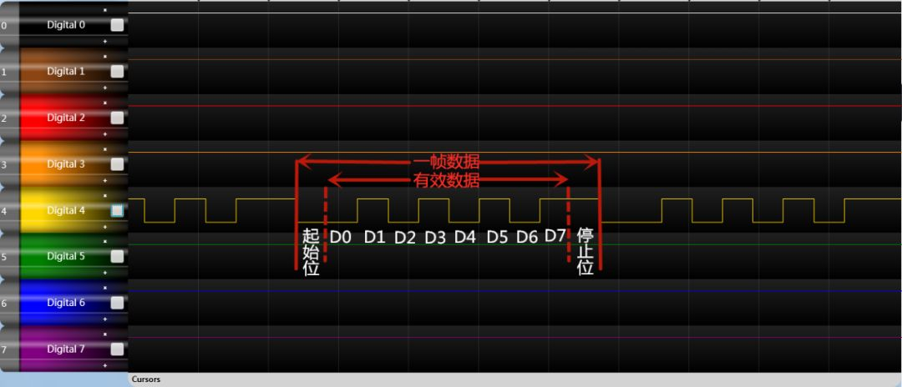
这是示波器上所测到的数据样图:


硬件: 设计电路时经常采用11.0592Mhz这样“不规则”晶振，看起来不规则，实际上很规则，原因是可以精确分频成常用波特率。

11.0592MHz = 11059200 = 115200 x 96

11.0592MHz = 11059200 = 57600 x 192

11.0592MHz = 11059200 = 19200 x 576

## 晶振

以11.0592M时钟的计数所需时间：假如我们在该方波的每个上升沿计一个数，则计11,059,200个数所需的时间为1s，所以计一个数所需的时间为1/11,059,200。

115200波特率下发送一位数据所需要的时间为：1/115200=8.68us。

传输一位所需的计数值为：8.68/(1/11,059,200)=96。11.0592M时钟115200波特率下计96数就会发送一位数据。


## 开发板联接方式

下面是用pc机联接开发板的图, 开发板芯片之间的整理连接图. 


### ESP32芯片相关的图
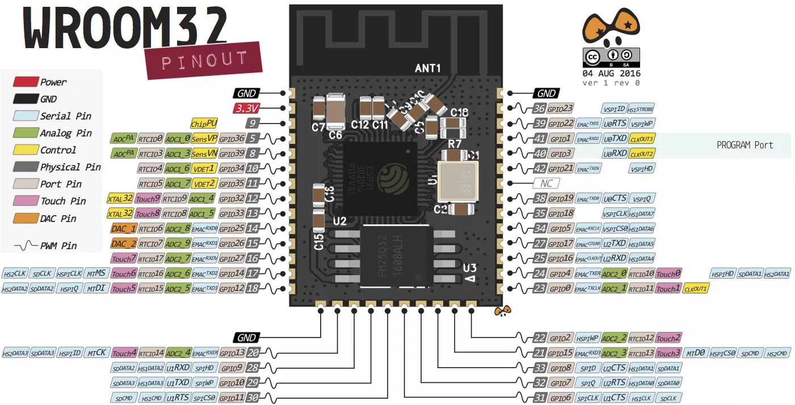

`ESP32` 芯片的解剖图, 会看到芯片里的结构和每个针脚的功能.

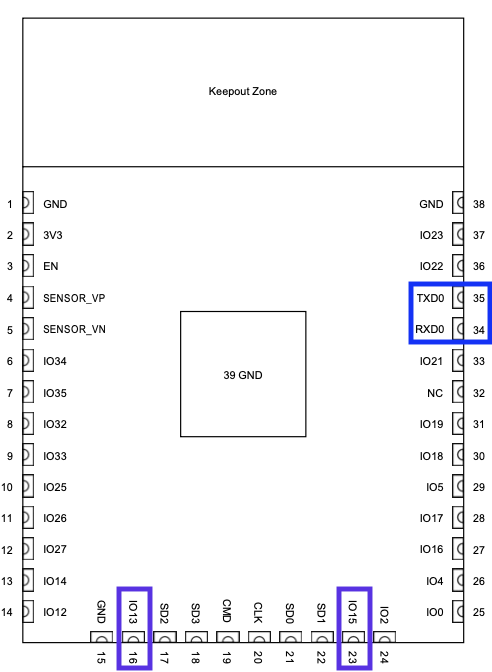

`ESP32` 针脚说明图.

1. 蓝色块内的针脚是用于连接到串口的 RX 和 TX 通信针脚.
2. 紫色块内的针脚是用于连接到串口的 RTS 和 CTS 控制针脚。


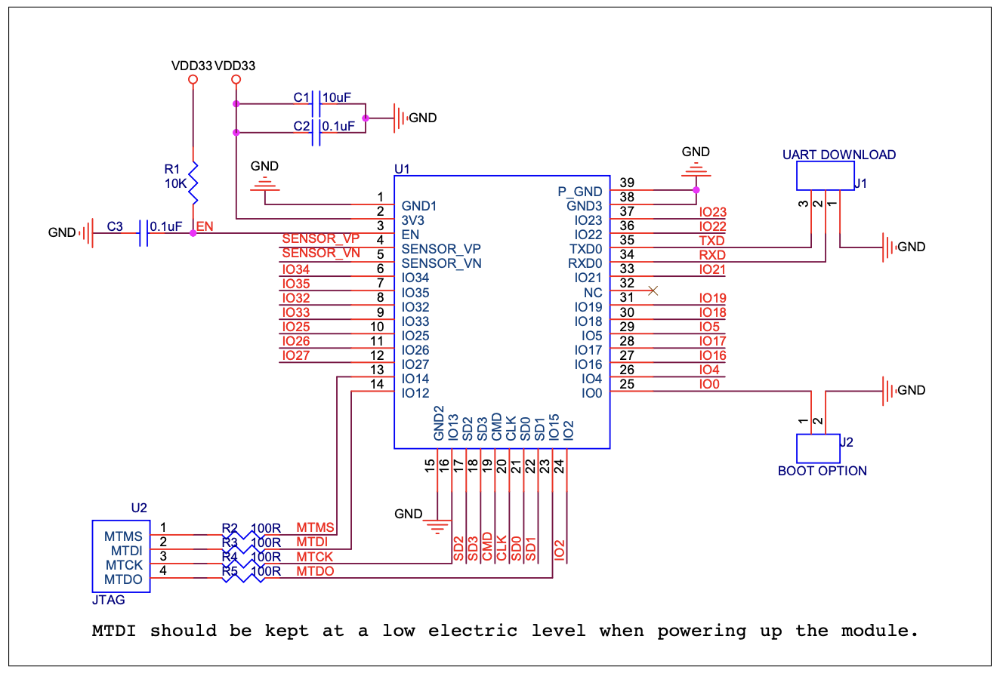

`ESP32` 芯片的原理图.


### CP2102芯片相关的图

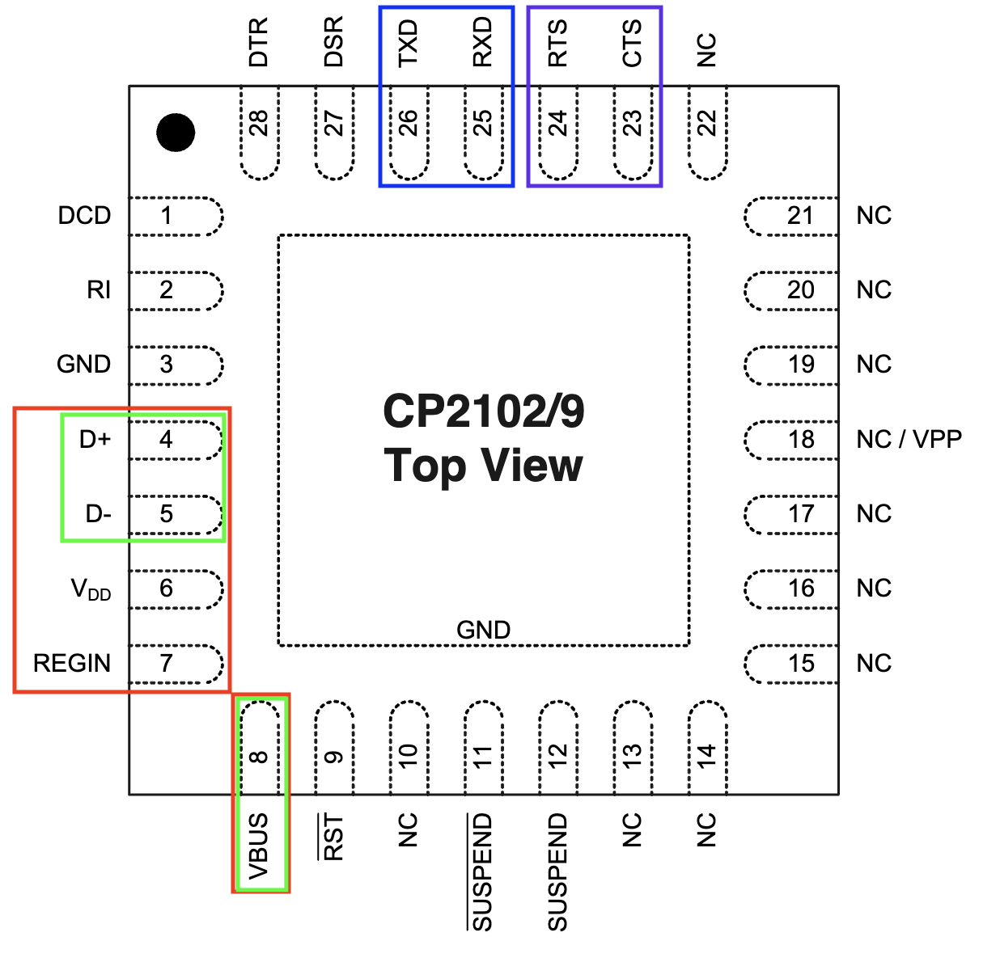

1. 蓝色块内的针脚是用接到 ESP32 的 uart 串口0上, TX0 和 RX0 分别接到了 ESP32针脚35和34上。
2. 紫色块内的针脚也用接到ESP32的IO3和IO5上, ESP32针脚16和23上。
3. 红色块内的针脚是用于接USB相关的针脚上.
4. 红色块内中绿色块的是用于连接到MircoUSB针脚上的。


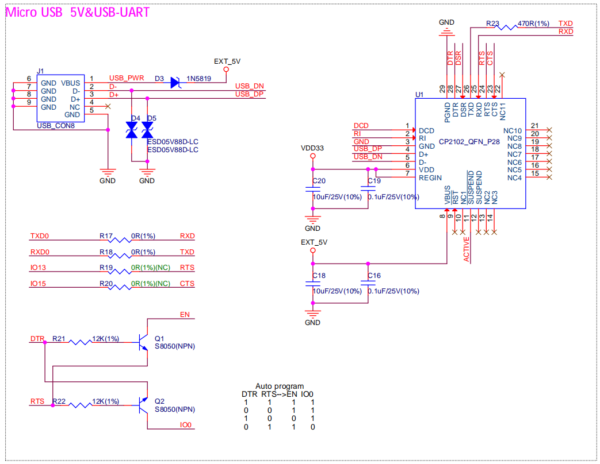

`CP2102` 芯片的原理图, 这块主要是与 `ESP32` 芯片进行串口通信的。


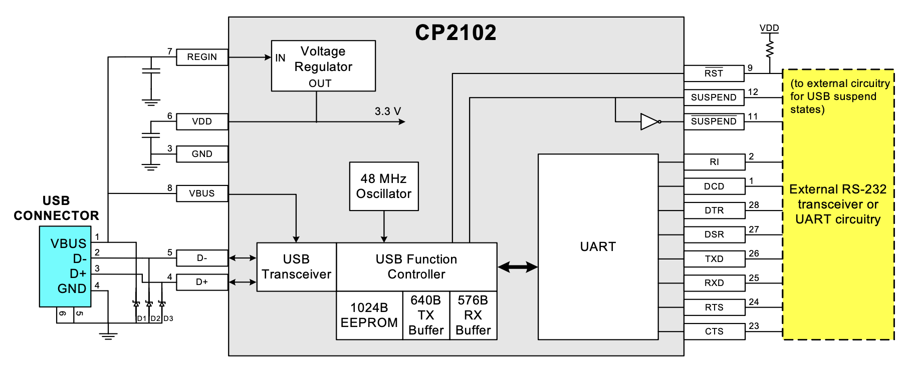

`CP2102` 芯片给出的官方电路图


## microUSB

Micro-B类型的USB接口，相信大家都认识，只是不知道它的专业名称，在智能手机发展的前期，绝大多数的智能手机（苹果手机除外）都采用了Micro-B型接口作为充电和数据接口。在USB 3.0标准发布后，Micro-B接口也有了新的造型，相信大家也不陌生，我们购买的支持USB 3.0的移动硬盘盒大部分就采用了该接口。

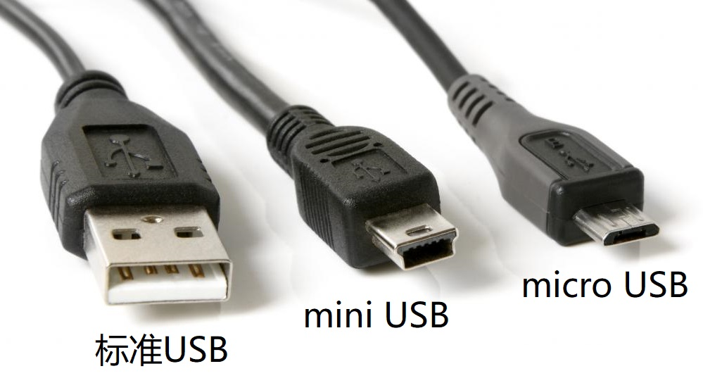


### 接口说明


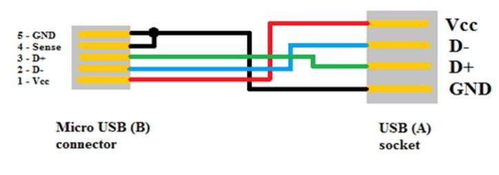

引脚 | 名称 | 线缆颜色 | 描述
-|-|-|-
1|VBUS|红色|+5V供电
2|D-|白色(主色)/蓝色|差分数据-
3|D+|绿色|差分数据+
4|ID|N/A|区分另一端接口类型 A 接口（主机）：接地 B接口（设备）：不连接
5|GND|黑色|地


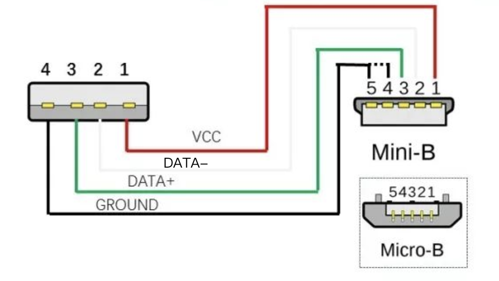

Mini USB除了第4针外，其他接口功能皆与标准USB相同。第4针成为ID，地线在mini-A上连接到第5针，在mini-B可以悬空亦可连接到第5针。


### USB 传输标准与接口

总结一下USB传输标准与接口之间的支持关系


## Arduino 串口编程

使用方法:

函数名称 | 函数功能
-----|--------
Serial. begin( ) | 括号内填设定的波特率
Serial.println( “data” ) | 从串行端口输出数据，跟随一个回车（ASCII 13, 或 'r'）和一个换行符（ASCII 10, 或 'n'）。这个函数所取得的值与 Serial.print()一样。
Serial.println(b) | 以十进制形式输出b的ASCII编码值，并同时跟随一个回车和换行符。
Serial.println(b, DEC) | 以十进制形式输出b的ASCII编码值，并同时跟随一个回车和换行符。
Serial.println(b, HEX) | 以十六进数据形式输出b的ASCII编码值，并同时跟随一个回车和换行符。
Serial.println(b, OCT) | 以八进数据形式输出b的ASCII编码值，并同时跟随一个回车和换行符。
Serial.println(b, BIN) | 以二进数据形式输出b的ASCII编码值，并同时跟随一个回车和换行符。
Serial.print(b, BYTE) | 以单个字节输出b，并同时跟随一个回车和换行符。
Serial.println(str) | 如果 str是一个字符串或数组，输出整个 str的 ASCII编码字符串。
Serial.println() | 仅输出一个回车和换行符。

**b:需要输出的字节；**

**str:需要输出的字符串;**

这是 HardwareSerial.h - Hardware serial library for Wiring 文件定义的 begin 函数

```cpp
void begin(unsigned long baud, 
			uint32_t config=SERIAL_8N1, 
			int8_t rxPin=-1, 
			int8_t txPin=-1, 
			bool invert=false, 
			unsigned long timeout_ms = 20000UL, 
			uint8_t rxfifo_full_thrhd = 112);
```

参数 | 说明
-----|--------
baud|串口波特率，该值写0则会进入自动侦测波特率程序；
config | 串口参数，默认SERIAL_8N1为8位数据位、无校验、1位停止位；SERIAL_8N1 = 0x800001c,
rxPin | 接收管脚针脚号
txPin | 发送管脚针脚号
invert | 翻转逻辑电平，串口默认高电平为1、低电平为0（true\fales）
timeout_ms | 自动侦测波特率超时时间，如果超过该时间还未获得波特率就不会使能串口
rxfifo_full_thrhd | Request To Send	请求发送（RTS）的值. (这一般用于调制解调器将数据提交。)


注: 调制解调器最早的是用于上网的设备。外接设备需要接到pc机上的串口上. 速率最快的为 56Kbps, 速度最慢的为 2400bps.

## 参考文档

[1. ESP32 datasheet 中文](../public/datasheet/esp32-wroom-32_datasheet_cn.pdf)

[2. ESP32 datasheet 英文](../public/datasheet/esp32-wroom-32_datasheet_en.pdf)

[3. CP2102 datasheet](../public/datasheet/cp2102.pdf)

[4. Devkit_v4](../public/datasheet/esp32_devkitc_v4-sch.pdf)

[5. Hardware Design](../public/datasheet/esp32_hardware_design_guidelines_cn.pdf)

[6. Technical Reference](../public/datasheet/esp32_technical_reference_manual_cn.pdf)


