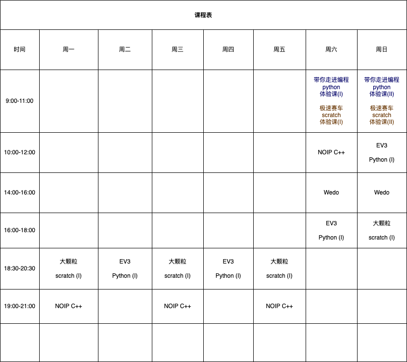

# 课表

 时间 | 周一 | 周二 | 周三 | 周四 | 周五 | 周六 | 周日
 ----|----|-------|-----|-----|-----|-----|-----
 上午09:00-11:00| | | | | | 带你走进编程世界 python体验课 (I) | 带你走进编程世界 python体验课 (II)
 上午10:00-12:00|
 下午 2:00-4:00|
 下午 2:00-4:00|

##### * 每课中间休息15分钟. 并有10分钟眼保健操