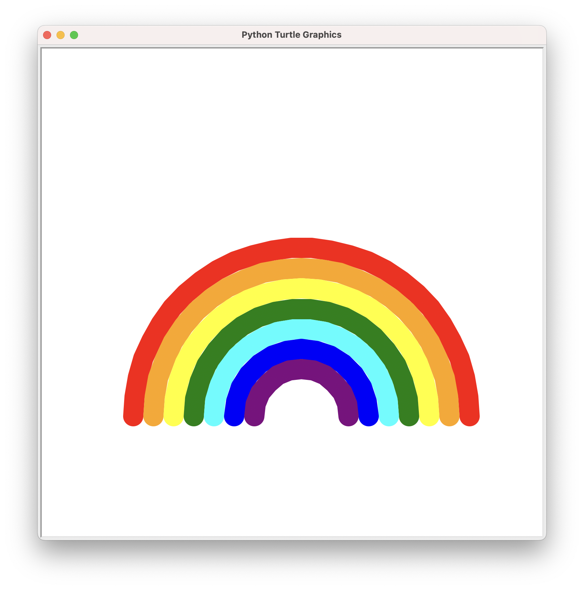

# 带你走进编程世界II

[[toc]]

## 复习回顾

复习一下上次课我们所学的画图函数.

## 五角星

::: details 代码

<<< @/code/open/wu.py{py}

:::

## 美国队长盾牌

::: details 代码

<<< @/code/open/dun.py{py}

:::

## 彩虹

::: details 代码

<<< @/code/open/caihong.py{py}

:::

