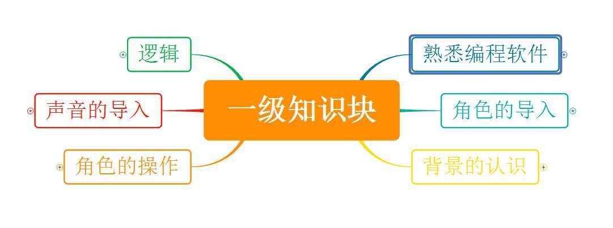
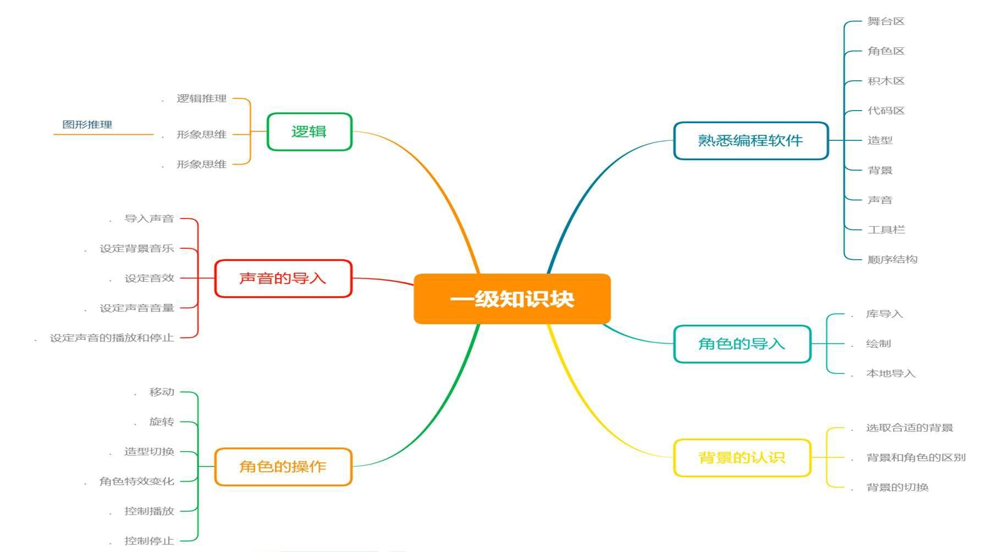

# 软件编程（图形化）一级

## 一、考试标准

（一）、初步学会使用编程工具，理解编程工具中的核心概念。

1)	理解编程环境界面中功能区的分布与作用；

2)	能够完成拖拽程序模块到程序区的操作并进行正确的连接；

3)	能够通过舞台区按钮完成运行与停止程序的操作；

4)	会使用角色的移动、旋转指令模块；

5)	能为作品添加背景音乐，并设置声音的播放代码；

6)	能够绘制背景并对背景进行切换；

7)	能够打开计算机上已保存的项目和保存新制作的项目。

（二）、按照规定的功能编写出完整的顺序结构程序。

1)	掌握顺序结构流程图的画法；
 
2)	理解参数的概念，能够调整指令模块中的参数；

3)	能够完成一个顺序结构的程序；

4)	程序中包含播放一段音频和切换背景；

5)	程序中包含切换角色的造型，角色移动和旋转；

6)	按指定的要求保存作品。

## 二、考核目标

学生对编程软件的界面认识和基本操作，初步能够导入角色和设置背景，并通过对角色的不同操作以及加入声音，形成一个具有简单顺序结构代码的作品，同时针对参加 1 级考试的学生将进行简单的逻辑推理能力的考查。

## 三、能力目标

通过本级考试的学生，对软件认识良好，会进行软件的基本操作，能完成基本作品。

## 四、知识块

知识块思维导图（一级）

## 五、知识点描述

| 编号 | 知识块 | 知识点 |
| - | - | - |
| 1 | 熟悉编程软件 | 舞台区，角色区，模块区，脚本区，造型标签，声音标签，背景标签，新建和保存作品，语言的选择，从本地打开软件，程序的运行和停止|
| 2 | 角色的导入 | 库导入，绘制，本地导入等方式，大小设置，顺序结构流程图 |
| 3 | 背景的认识 | 选取合适的背景，背景和角色的区别，背景的切换 |
| 4 | 角色的操作 | 移动，旋转，造型切换 |
| 5 | 声音的导入 | 导入声音并设置为背景音乐，设定声音音效，设定声音音量，设定声音的播放和停止 |
| 6 | 逻辑推理，编程数学 | 逻辑推理，形象思维（图形推理） |

知识块思维导图（一级）

## 六、题型配比及分值

| 知识体系 | 单选 | 判断 | 分值 |
| - | - | - | - |
| 平台操作（14 分） | 6 | 2 | 6 |
| 造型以及背景切换（30 分） | 14 | 6 | 10 |
| 角色的操作（30 分） | 14 | 6 | 10 |
| 声音（16 分） | 8 | 4 | 4 |
| 逻辑推理和编程数学（10 分） | 8 | 2 | 0 |
| 分值 | 50 | 20 | 30 |
| 题数 | 25 | 10 | 2 |