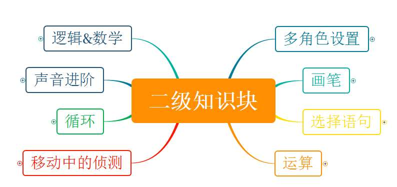
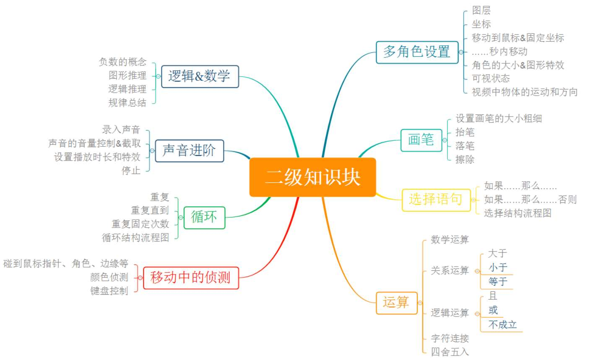

# 软件编程（图形化）二级

## 一、考试标准

（一）、理解编程工具的进阶相关概念，掌握编程工具中进阶模块的使用。

1) 理解舞台区层的概念；
   
2) 理解舞台区坐标系的概念；
   
3) 能够使用选择结构的指令；
   
4) 能够使用实现循环的指令；
   
5) 能够使用画笔及设置画笔的大小粗细；
   
6) 能够控制角色的大小，特效和可视状态；
   
7) 能够使用侦测相关的指令；
   
8)  能够录入声音，并且对声音进行简单处理；
   
9)  掌握数学运算，逻辑运算和关系运算并应用；
    
（二）、能应用编程工具中的指令实现进阶效果的程序。

1) 掌握选择结构、循环结构的流程图画法；
   
2) 程序包含选择结构，处理多个条件之间的关系；
   
3) 程序中包含循环结构；
   
4) 程序中包含侦测场景的实现；
   
5) 程序中能使用画笔实现效果；
    
6)  程序中按照要求对不同角色进行不同效果的设置。

## 二、考核目标

学生对编程软件的进一步操作能力，对多角色的位置，上下层关系等设置，侦测和选择语句以及综合不同模块进行问题的解决；考查对各循环语句的掌握程度。同时针对参加2级考试的学生将进行一般逻辑推理和总结归纳能力的考查。

## 三、能力目标

通过本级考试的学生，有一定的逻辑推理能力，熟练使用侦测和选择
语句解决问题，能独立完成包含分支语句，循环语句等比较综合的案例。

## 四、知识块

知识块思维导图（二级）

## 五、知识点描述

| 编号 | 知识块 | 知识点 |
| - | - | - |
| 1 | 多角色设置 | 图层，坐标，移动到鼠标，移动到固定坐标，…秒内移动，角色的大小，特效，可视状态，视频侦测中物体的运动和方向|
| 2 | 画笔 | 画笔的大小粗细设置，抬笔，落笔，擦除 |
| 3 | 选择语句 | 如果……那么……，如果…那么……否则……，选择结构流程图 |
| 4 | 运算 | 数学运算，关系运算（大于，小于，等于），逻辑运算（且，或，不成立），字符连接，四舍五入 |
| 5 | 移动中的侦测 | 碰到鼠标指针、角色、边缘等，颜色侦测，键盘控制 |
| 6 | 循环语句 | 重复，重复直到…，重复固定次数，循环结构流程图 |
| 7 | 声音的进阶 | 录入声音，声音的音量控制，声音的截取，设置播放时长和特效，停止 |
| 8 | 逻辑推理，爱编数学 | 负数的概念，图形推理，逻辑推理，规律总结） |

知识块思维导图（二级）

## 六、题型配比及分值

| 知识体系 | 单选 | 判断 | 编程 |
| - | - | - | - |
| 多角色的设置（10 分） | 6 | 2 | 2 |
| 画笔（10 分） | 4 | 2 | 4 |
| 选择语句（18 分） | 8 | 4 | 6 |
| 循环语句（18 分） | 8 | 4 | 6 |
| 侦测（14 分） | 6 | 2 | 6 |
| 运算&声音（20 分） | 10 | 4 | 6 |
| 逻辑推理和编程数学（10 分） | 8 | 2 | 0 |
| 分值 | 50 | 20 | 30 |
| 题数 | 25 | 10 | 2 |