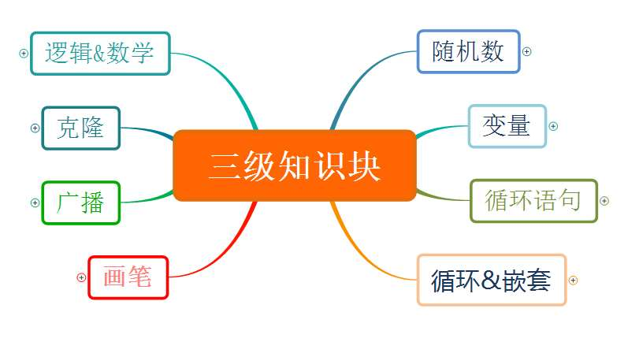
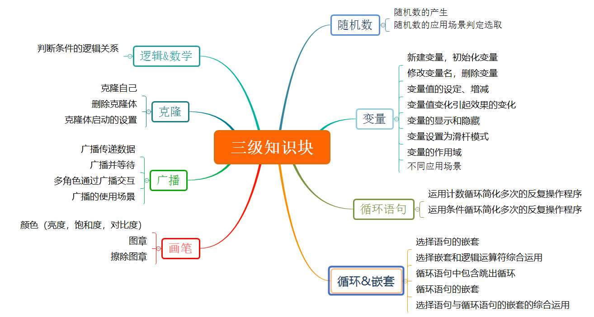

# 软件编程（图形化）三级

## 一、考试标准

（一）.掌握编程环境的高级功能，并理解其中的基本概念。

1) 能够新建、删除变量，修改变量名；
   
2) 能够设定、增减变量值，在舞台区显示、隐藏变量；
   
3) 能够灵活使用画笔及设置画笔的各项参数；
   
4) 掌握逻辑运算与关系运算的组合使用；
   
5) 能够运用循环简化多次的反复操作程序；
   
6) 能够应用广播来传递数据，实现不同角色之间的交互；
   
7) 能够理解广播和广播并等待的区别；
   
8) 能够应用克隆来生成克隆体，并灵活控制克隆体。

（二）.理解并在程序中使用随机数和变量。

1) 理解随机数的概念，能够产生一个随机数；
   
2) 理解变量的概念，理解变量的作用域；
   
3) 能够通过变量的变化让程序跳转到不同的部分；
   
4) 程序中包含不同条件选择语句的嵌套；
   
5) 程序中包含循环语句的嵌套；
   
6) 程序中包含根据选择语句的真假跳出循环程序；
   
7) 循环语句、选择语句嵌套的综合运用。

## 二、考核目标

进一步认识编程软件的高级功能，对随机数的产生、变量的设置，基于变量的逻辑运算与关系运算的组合使用，解决实际问题；考查画笔模块的更高级操作，应用广播来传递数据，应用克隆来生成克隆体，并灵活控制克隆体；考查对选择语句、循环语句的嵌套使用，以及运用循环简化多次的反复操作程序的理解程度。同时针对参加3级考试的学生将进行多种情况的逻辑处理和交互控制能力的考查。

## 三、能力目标

学生对编程软件的进一步综合操作能力，考查对随机数、变量、广播、克隆等知识的掌握，同时考查学生对已掌握知识的深度综合应用，另针对参加3级考试的学生将进行难度更高的逻辑推理能力的考查。

## 四、知识块

知识块思维导图（三级）

## 五、知识点描述

| 编号 | 知识块 | 知识点 |
| - | - | - |
| 1 | 随机数 | 随机数的产生，随机数的应用场景判定选取 |
| 2 | 变量 | 新建变量，初始化变量，修改变量名，删除变量，变量值的设定、增减，变量值变化引起效果的变化，变量的显示和隐藏，变量设置为滑杆模式，变量的作用域，不同应用场景 |
| 3 | 循环语句 | 运用计数循环简化多次的反复操作程序、运用条件循环简化多次的反复操作程序 |
| 4 | 循环与选择的嵌套 | 选择语句的嵌套、选择嵌套和逻辑运算符综合运用、循环语句中包含跳出循环、循环语句的嵌套、选择语句与循环语句的嵌套的综合运用 |
| 5 | 画笔 | 颜色（亮度，饱和度，对比度），图章，擦除图章 |
| 6 | 广播 | 广播传递数据，广播并等待，多角色通过广播交互，广播的使用场景 |
| 6 | 克隆 | 克隆自己，删除克隆体，克隆体启动的设置 |
| 6 | 逻辑推理，编程数学 | 判断条件的逻辑关系 |

知识块思维导图（三级）

## 六、题型配比及分值

| 知识体系 | 单选 | 判断 | 编程 |
| - | - | - | - |
| 随机数（8 分） | 6 | 2 | 0 |
| 变量（12 分） | 6 | 4 | 2 |
| 循环语句（30 分） | 4 | 2 | 6 |
| 循环与选择的嵌套（16 分） | 6 | 2 | 10 |
| 画笔（10 分） | 8 | 4 | 0 |
| 广播 | 6 | 2 | 6 |
| 克隆 | 6 | 2 | 6 |
| 逻辑推理，编程数学 | 8 | 2 | 0 |
| 分值 | 50 | 20 | 30 |
| 题数 | 25 | 10 | 3 |