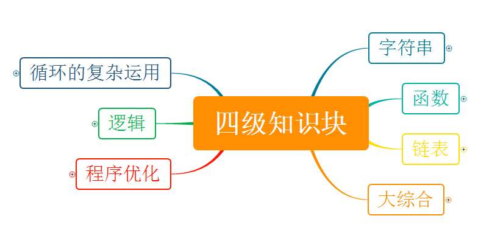
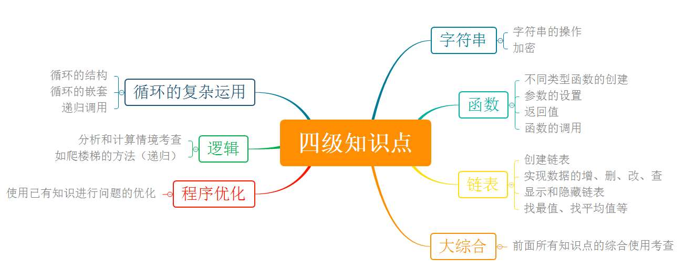

# 软件编程（图形化）四级

## 一、考试标准

(一)、理解并使用链表、函数和多线程。

1) 能够新建链表;
   
2) 能够完成对链表中数据的插入、删除;
   
3) 字符串处理;
   
4) 能够自己创建一个有返回值的函数;
   
5) 理解函数的作用范围；
   
6) 理解多线程的概念;
   
7) 循环的复杂运用；
   
8) 逻辑，算法过渡。

## 二、考核目标

学生对编程软件的较强综合操作能力，考查使用软件进行数据处理的能力，同时对函数和过程的理解和使用进行考查，以及学生对已掌握知识的深度综合应用及思考更优程序方案，另针对参加4级考试的学生将进行综合分析和计算的情境考查。

## 三、能力目标

通过本级考试的学生，逻辑推理能力很不错，对数据的处理，函数和过程等的理解和使用掌握得很不错，对已学知识的综合应用能力很好，具备一定的程序调试和优化能力。学生对编程软件的进一步综合操作能力，考查新建链表，字符串处理，循环的复杂运用，理解函数的作用范
围，理解多线程的概念，同时考查学生对已掌握知识的深度综合应用，另针对参加4 级考试的学生将进行难度更高的逻辑推理能力的考查。

## 四、知识块

知识块思维导图（四级）

## 五、知识点描述

| 编号 | 知识块 | 知识点 |
| - | - | - |
| 1 | 字符串 | 字符串操作、加密|
| 2 | 函数 | 不同类型函数的创建，参数的设置，返回值，函数的调用 |
| 3 | 链表 | 创建链表，实现数据的增、删、改、查，显示和隐藏，找最值，平均值等 |
| 4 | 大综合 | 前面所有知识点的综合使用，考查 |
| 4 | 程序优化 | 使用已有知识进行问题的优化 |
| 4 | 逻辑、算法过渡 | 分析和计算情境考察，如爬楼梯的方法（递归） |
| 4 | 循环的复杂应用 | 循环的结构，循环的嵌套，递归调用 |

知识块思维导图（四级）

## 六、题型配比及分值

| 知识体系 | 单选 | 判断 | 编程 |
| - | - | - | - |
| 字符串（8 分） | 4 | 4 | 0 |
| 函数（12 分） | 6 | 4 | 0 |
| 循环语句（12 分） | 4 | 4 | 10 |
| 链表（10 分） | 6 | 4 | 10 |
| 逻辑（12 分） | 4 | 2 | 0 |
| 算法（10 分） | 6 | 2 | 10 |
| 程序优化（10 分） | 0 | 0 | 10 |
| 大综合（10 分） | 0 | 0 | 10 |
| 分值 | 30 | 20 | 50 |
| 题数 | 15 | 10 | 5 |